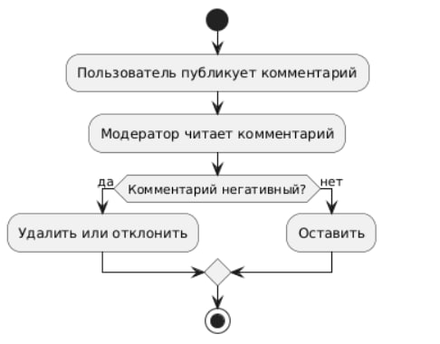
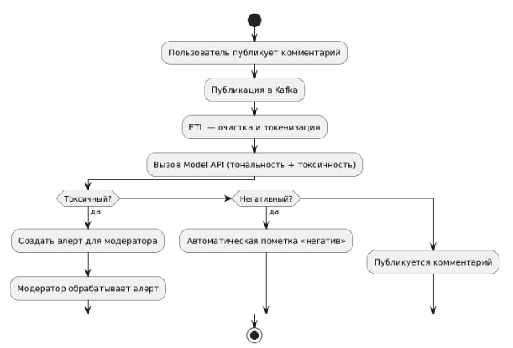
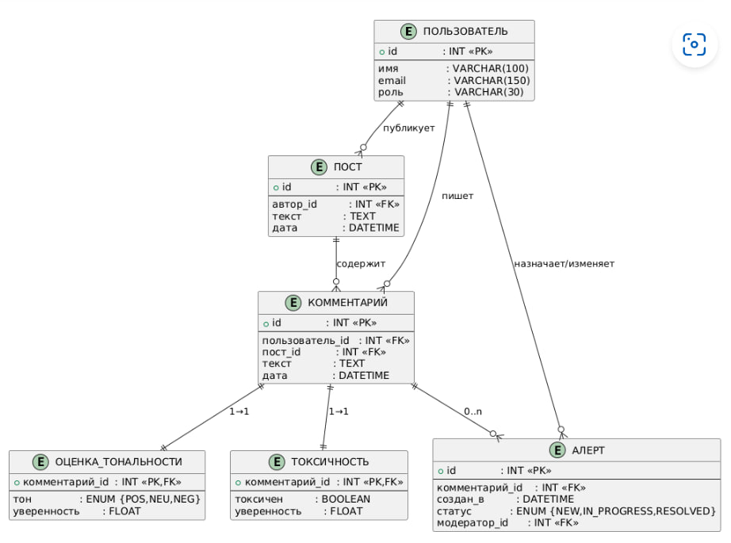
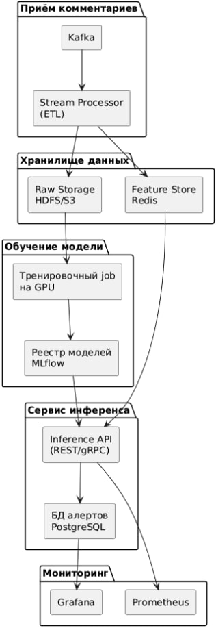
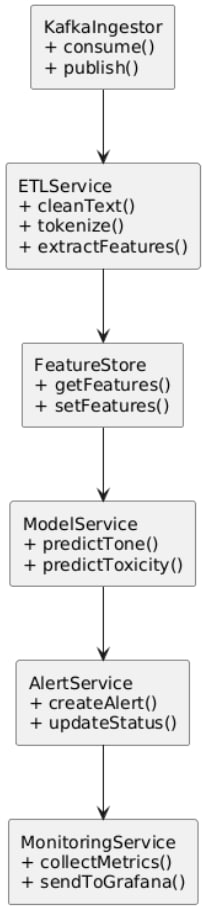
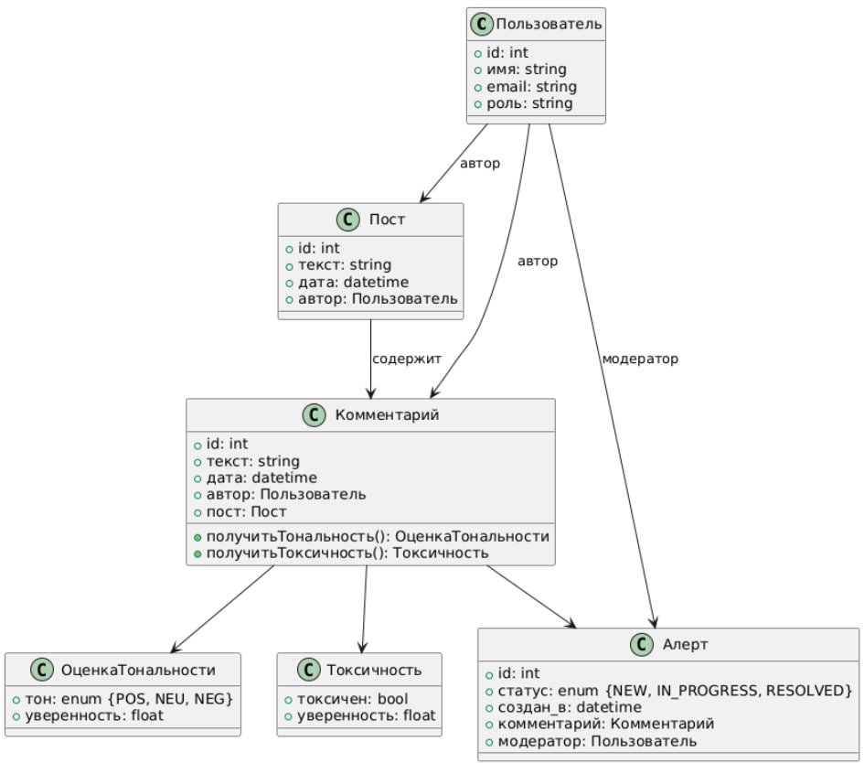
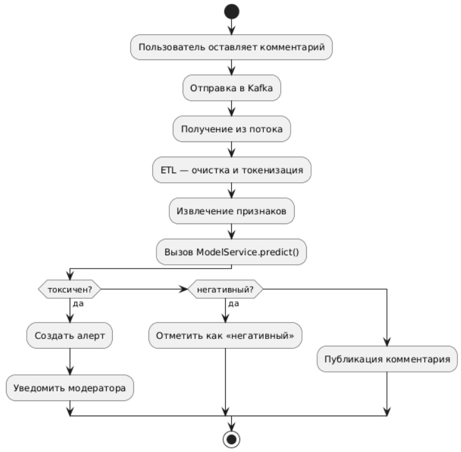

**Автоматизация анализа тональности и токсичности комментариев в соцсети**

**Состав команды**

- Дерещук Татьяна - владелец продукта (product owner), архитектор (software architect)

- Евдокимоа Ульяна - дата-инженер (data engineer), дата-аналитик (data scientist)

**1. Цели и предпосылки**

- Зачем: Уменьшить ручную нагрузку на модераторов, ускорить выявление нарушений, снизить риск штрафов от РКН.

- Проблема: Сейчас всё вручную → субъективно, медленно, дорого.

- Как станет лучше: ML-модель классифицирует тональность и токсичность автоматически.

**Бизнес-цель.**
-	Автоматизировать анализ тональности и токсичности комментариев в соцсети (до 500 000 в день), снизить задержку модерации, уменьшить субъективность и риск штрафов со стороны РКН.

**Почему ML?**
- Скорость: от миллисекунд на комментарий вместо ручного разбора.

- Масштабируемость: рост числа комментариев не ведёт к экспоненциальному росту затрат.

- Консистентность: единая модель вместо разных решений разных модераторов.

**Бизнес-требования и ограничения.**

- Обработка пиков до 20+ запросов в секунду.

- FP (ложноположительных) ≤ 5% для токсичных комментариев.

- SLA uptime ≥ 99.9%, latency end-to-end ≤ 300 мс.

**Функциональные требования.**

  1.	Классификация тональности: позитив/нейтраль/негатив.

  2.	Детекция токсичности: бинарная метка + уверенность.

  3.	Генерация алертов для модераторов.

  4.	Хранение результатов в БД для отчётности.

**Нефункциональные требования.**

- GDPR-совместимость: удаление персональных данных старше 30 дн.

- Масштабируемость через Kubernetes + авто-скейлинг.

- Мониторинг через Prometheus/Grafana.
  
**2. Методология**

**Тип решения.**

- Задача классификации текста: трансформерная модель (BERT/RoBERTa) для тональности и токсичности.

**Необходимые данные.**

- Комментарии + ручная разметка тональности и токсичности (минимум 100 000 примеров).

- Контекст (текст поста, историю пользователя) — для будущего расширения.

**Метрики ML.**

- Precision и Recall для классов «toxicity» и «negative».

- F1-score негативного класса ≥ 0.9.

- ROC-AUC для токсичности ≥ 0.95.

- Latency inference ≤ 200 мс.

**Связь с бизнесом.**

- Снижение времени модерации на 70%.

- Сокращение ручной работы модераторов.

- Минимизация штрафов за пропуск запрещённого контента.

**Риски и меры.**

- Bias в разметке → двойная разметка, метрика κ (Cohen’s kappa).

- Дрейфт языка → ежемесячный ретренинг на свежих данных.

- Неполнота словаря → дообучение токенизатора, подбор стоп-слов.

**3. Подготовка пилота**

**Процесс пилота.**

  1.	Собрать и разметить 100 000 комментариев.

  2.	Обучить прототип на GPU.

  3.	Деплой в тестовый кластер, прогон реальных потоков (10% трафика).

  4.	Сравнить решения модераторов vs. ML: метрики precision/recall, latency.

**Критерии успеха.**

- ML-модель по toxic-классу: Precision ≥ 90%, Recall ≥ 85%.

- Latency ≤ 200 мс.

- Удовлетворённость модераторов (опрос).

**MVP vs техдолг.**

- MVP: базовый пайплайн (Kafka → ETL → ModelService → AlertsDB → Dashboard).

- Техдолг: автоматическое дообучение, мультиязычность, Explainable AI-модули.

**4. Внедрение в production**

**Архитектура.**

- Kafka для сбора, Flink/Beam для ETL, HDFS/S3 для raw, Redis feature store.

- Training на GPU-нодах, MLflow registry.

- Inference в REST/gRPC-сервисе на CPU-скейлах.

- Alerts в PostgreSQL, мониторинг через Prometheus+Grafana.

**Инфраструктура и масштабируемость.**

- Kubernetes-кластер с авто-скейлингом (HPA).

- GPU-пулы для обучения, CPU-пулы для inference.

- Плюсы: отказоустойчивость, быстрое масштабирование. Минусы: сложность эксплуатации.

**Требования к SLA/RPS/Latency.**

- Uptime ≥ 99.9%.

- RPS ≥ 20.

- P95 latency ≤ 300 мс.

**Операционные риски.**

- Пики нагрузки → буферизация в Kafka + авто-скейлинг.

- Обновления модели → канареечный релиз.

- Сбоев в инфраструктуре → резервирование зон и бэкапы

**Диаграммы**

**1. Диаграмма активности ДО внедрения (ручная модерация)**  

Что показывает:

Пошаговый бизнес-процесс, в котором пользователь публикует комментарий, а модератор вручную читает его и принимает решение: оставить или удалить/отклонить.

Ключевые элементы:

-	Начало и конец процесса.
-	Шаги: «Пользователь публикует комментарий» → «Модератор читает комментарий».
-	Узел принятия решения «Комментарий негативный?» с двумя ветками: «да → удалить/отклонить», «нет → оставить».

Зачем:

Иллюстрирует текущее «узкое место» ручной модерации и обосновывает переход к автоматизации.
 
**2. Диаграмма активности ПОСЛЕ внедрения (автоматизированная модерация)**

Что показывает:

Как комментарий идёт через потоковую систему и ML-модуль: публикация в Kafka, ETL-обработка, вызов модели, ветвления по токсичности и тональности, генерация алертов или публикация.

Ключевые элементы:
-	Запись комментария в Kafka.
-	Блок ETL: очистка и токенизация.
-	Вызов Model API (тональность + токсичность).
-	Узлы решения: «Токсичный?», «Негативный?».
-	Действия по веткам: создание алерта, авто-пометка «негатив», либо публикация без изменений.

Зачем:

Демонстрирует новую автоматизированную логику модерации, показывающую, где именно подключается ML.
 
**3. ER-диаграмма структуры данных**

Что показывает:

Шаблон отношений между таблицами базы данных, необходимых для хранения информации о пользователях, постах, комментариях, результатах классификации (тональность, токсичность) и алертах.

Сущности и связи:
-	ПОЛЬЗОВАТЕЛЬ → ПОСТ (публикует), КОММЕНТАРИЙ (пишет), АЛЕРТ (назначает/изменяет).
-	ПОСТ → КОММЕНТАРИЙ (содержит).
-	КОММЕНТАРИЙ → ОЦЕНКА_ТОНАЛЬНОСТИ, ТОКСИЧНОСТЬ (1:1), АЛЕРТ (0..n).

Зачем:

Обеспечивает понимание, какие данные и в каких таблицах будут храниться и как они связаны.
 
**4. Диаграмма архитектуры решения**

Что показывает:

Высокоуровневую компонентную архитектуру всей системы: от приёма комментариев до мониторинга.

Компоненты:
-	Приём комментариев: Kafka + Stream Processor (ETL).
-	Хранилища: Raw Storage (HDFS/S3) для сырых данных и Feature Store (Redis).
-	Обучение модели: GPU-job → MLflow Registry.
-	Сервис инференса: REST/gRPC API + база алертов (PostgreSQL).
-	Мониторинг: Prometheus и Grafana.

Зачем:

Показывает, как данные движутся по системе, где происходит обучение и где inference, и как организовано наблюдение за здоровьем кластера.
 
**5. Компонентная диаграмма**

Что показывает:

Декомпозицию приложения на логические сервисы/модули и их взаимодействие.

Компоненты и методы:
-	KafkaIngestor (consume, publish)
-	ETLService (cleanText, tokenize, extractFeatures)
-	FeatureStore (getFeatures, setFeatures)
-	ModelService (predictTone, predictToxicity)
-	AlertService (createAlert, updateStatus)
-	MonitoringService (collectMetrics, sendToGrafana)

Зачем:

Упрощает понимание ответственности каждого модуля и облегчает планирование разработки и развертывания.
 
**6. UML-диаграмма классов**

Что показывает:

Объектно-ориентированную схему основных классов в кодовой базе и их связи.

Классы и атрибуты:
-	Пользователь (id, имя, email, роль)
-	Пост (id, текст, дата, автор)
-	Комментарий (id, текст, дата, автор, пост, методы получения тональности/токсичности)
-	ОценкаТональности, Токсичность (тон, уверенность; токсичен, уверенность)
-	Алерт (id, статус, создан_в, комментарий, модератор)

Зачем:

Детализирует структуру бизнес-объектов и их атрибуты для разработки API и DAO-слоя.
 
**7. Диаграмма активности (детальная) обработки комментария**

Что показывает:

Подробный workflow от поступления комментария в систему до итогового действия (alert или публикация).

Шаги:

1.	Пользователь оставляет комментарий.

2.	Отправка в Kafka.

3.	Получение из потока.

4.	ETL: очистка и токенизация.

5.	Извлечение признаков.

6.	Вызов ModelService.predict().

7.	Ветвление по результатам:
	«токсичен?» → создать алерт и уведомить модератора
-	«негативный?» → пометить «негативный»
-	иначе → публиковать без изменений.

Зачем:

Демонстрирует именно последовательность операций внутри ML-конвейера и позволяет выявить потенциальные оптимизации в каждом шаге.
 

